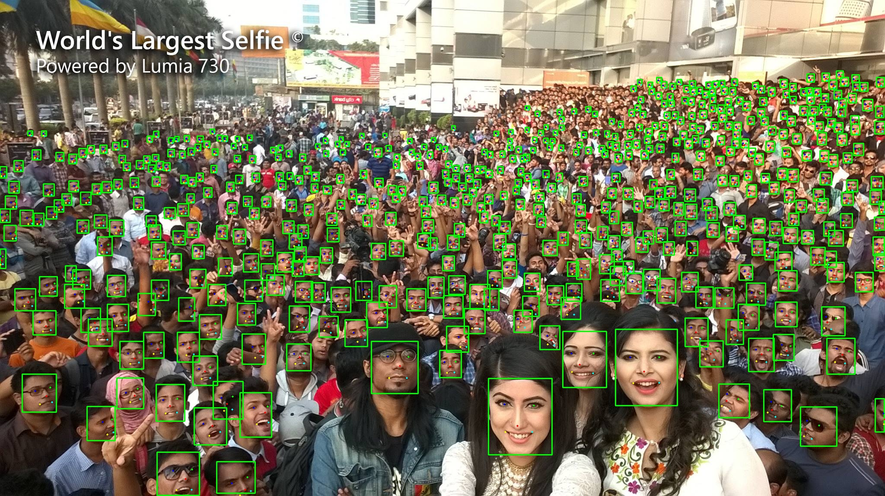

# yolov7-face TensorRT

## yolov7-face

  The Pytorch implementation is [yolov7-face](https://github.com/derronqi/yolov7-face).

## **onnx export**

  step1.  git clone  https://github.com/derronqi/yolov7-face

  step2.  modify models/export.py

```
 #line 72
 #output_names = None
 # modified into:
 output_names = ["output"]
```

   step3.  modify models/yolo.py   class  IKeypoint

```
#line 308
# return x if self.training else (torch.cat(z, 1), x)
# modified into:
return x if self.training else torch.cat(z, 1)
```

  step3. Export to onnx model

```
 cd yolov7-face
 python models/export.py --weights yolov7s.pt --grid 
```

## How to Run, yolov7s-face  as example

1. Modify the tensorrt cuda opencv path in CMakeLists.txt

   ```
   #cuda 
   include_directories(/mnt/Gu/softWare/cuda-11.0/targets/x86_64-linux/include)
   link_directories(/mnt/Gu/softWare/cuda-11.0/targets/x86_64-linux/lib)

   #tensorrt 
   include_directories(/mnt/Gpan/tensorRT/TensorRT-8.2.0.6/include/)
   link_directories(/mnt/Gpan/tensorRT/TensorRT-8.2.0.6/lib/)
   ```
2. build

   ```
   1. mkdir build
   2. cd build
   3. cmake ..
   4. make

   ```
3. onnx  to tensorrt model

   ```
   ./onnx2trt/onnx2trt  ../onnx_model/yolov7s-face.onnx ./yolov7s-face.trt  1

   ```
4. inference

   ```
   ./yolov7_face yolov7s-face.trt ../images
   ```

   The results are saved in the build folder.

   

## contact

Tencent qq group:  871797331
